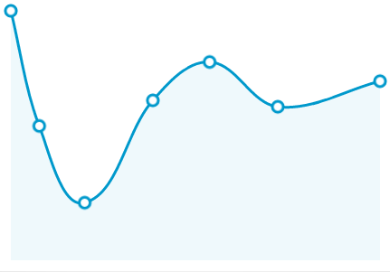

Smooth Line Chart
=================

This is a sample custom view for Android that shows how to draw smooth line charts. 

How it works
=================

The draw() function uses cubic splines to make the lines smoother. 
Control points are calculated such that the tangent line in each point is parallel to the virtual line that joins the previous and the next point. 
Furthermore, the distance between a control point and its related point is proportional to the distance between the point and the adjacent point (the next or previous one depending on the position of the control point).
